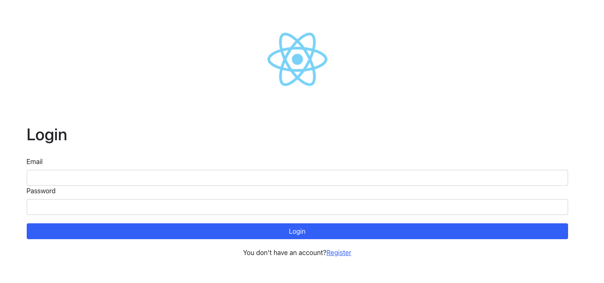
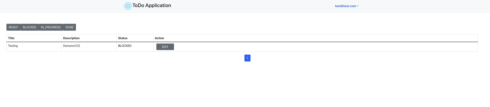

# Technical Criteria - Readme

## Application default configuration

<hr/>
To make it easier for development process, we still expose these ports on the local machine to send request directly with services or to view actual data in the data stores. 
In production environment, we leverage the infrastructure to make the downstream services become unreachable from the client, we only expose one single point - API Gateway.

| Service         | Port (customizable) |
| --------------- | ------------------- |
| graphql service | 5001                |
| react           | 3000                |
| mysql           | 3306                |

## Local Development Guideline

<hr/>

### 1. Prerequisites

- NodeJS (v16 or above), `npm` and `yarn`
- `Docker`
- `Makefile` - (optional)

### 2. Setup Local Development Environment

<br/>

1. Clone the project to local machine and go to the folder

```
git clone https://github.com/DaiThanh97/todo-technical-test.git
cd todo-technical-test
```

2. Run `make bootstrap-server` cli to bootstrap the application.

**OR**

1. Start the infrastructure using (optional)

```
### MySQL
docker run -d --name mysql -p 3306:3306 -e MYSQL_ROOT_PASSWORD=123123 -e MYSQL_DATABASE=demo mysql
```

2. Run the back-end in development mode (live-reload support). Make sure that you're in root directory.

```
cd backend && yarn && yarn start:dev
```

3. Run the front-end in development mode (live-reload support). Make sure that you're in root directory.

```
cd frontend && yarn && yarn start
```

<br/>

**NOTE**: The app should be accessible at http://localhost:3000. The backend GraphQL can be accessed at http://localhost:5001/graphql. Please change `.env.example` to `.env` to bootstrap correctly.

### - Should access to backend through **Apollo Studio** to manually fetch data.

### - Frontend should look like this.




## Other Notes

<hr/>

### What I have completed

### 1. Functionalities

1. Login.
2. Register new user.
3. Create Todo: create new Todo.
4. Update Todo: update existing Todo.
5. Get list todos.

### 2. Others

1. Local Development Setup script.

### 3. What can be improved if have more times

1. More unit tests for `back-end`, `front-end`.
2. Write end-to-end tests.
3. Make an enhancement for UI.
